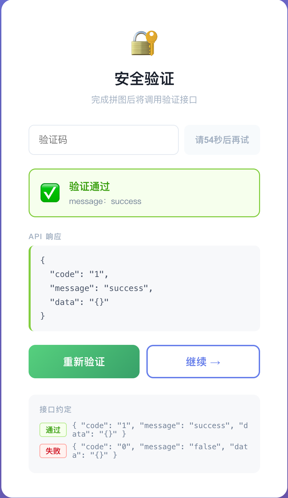
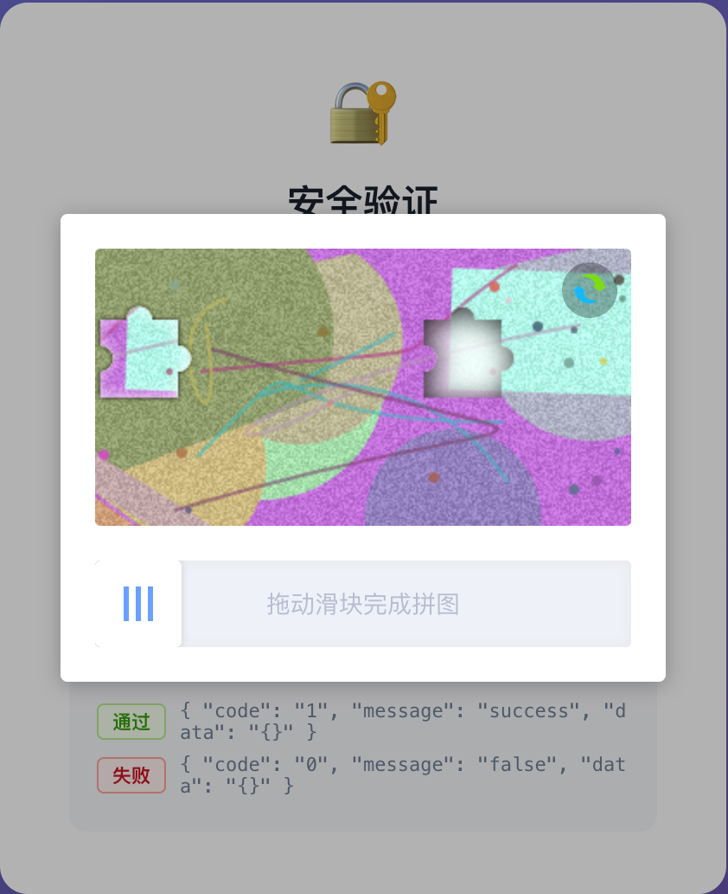

# SlideVerify React Components

> 拼图滑块验证人机，调用API发送验证码， React 单文件组件  
> 移植自 [vue-puzzle-vcode](https://github.com/javaLuo/vue-puzzle-vcode) · 无任何外部依赖

---

## 特性

- **单文件**：整个组件只有一个 `.jsx` 文件，复制即用
- **无外部依赖**：仅依赖 React 本身
- **自定义背景**：支持传入图片 URL 数组，未传时自动用 Canvas 生成随机彩色背景
- **移动端支持**：完整处理 `touchstart / touchmove / touchend`
- **无 stale closure**：核心运行时状态通过 `useRef` 统一管理，全局事件只注册一次，彻底避免 React 闭包过期问题

---

## 效果图

<div style="display: flex; gap: 20px;">
  <div style="flex: 1;">
    
  </div>
  <div style="flex: 1;">
    
  </div>
</div>

---

## 快速开始

### 1. 复制文件

将 `SlideVerify.jsx` 放入项目任意目录，例如 `src/components/`。

### 2. 引入并使用

```jsx
import { useState } from "react";
import { SlideVerify } from "./components/SlideVerify";

export default function LoginPage() {
  const [show, setShow] = useState(false);

  return (
    <>
      <button onClick={() => setShow(true)}>点击验证</button>

      <SlideVerify
        show={show}
        onClose={() => setShow(false)}
        onSuccess={(deviation) => {
          setShow(false);
          console.log("验证通过，偏差:", deviation);
          // 在此发起登录请求
        }}
        onFail={(deviation) => {
          console.log("验证失败，偏差:", deviation);
        }}
      />
    </>
  );
}
```

---

## Props

| 属性 | 类型 | 默认值 | 说明 |
|------|------|--------|------|
| `show` | `boolean` | `false` | 控制显示/隐藏，由父组件管理 |
| `canvasWidth` | `number` | `310` | 主画布宽度（px） |
| `canvasHeight` | `number` | `160` | 主画布高度（px） |
| `puzzleScale` | `number` | `1` | 拼图块大小缩放比例，范围 `0.2 ~ 2` |
| `sliderSize` | `number` | `50` | 滑块按钮的宽高（px） |
| `range` | `number` | `10` | 判定通过的允许误差（px），越小越严格 |
| `imgs` | `string[]` | `null` | 背景图片 URL 数组，随机取一张；不传则自动生成彩色背景 |
| `successText` | `string` | `"验证通过！"` | 验证成功时底部提示文字 |
| `failText` | `string` | `"验证失败，请重试"` | 验证失败时底部提示文字 |
| `sliderText` | `string` | `"拖动滑块完成拼图"` | 滑块轨道中央的提示文字 |
| `onSuccess` | `(deviation: number) => void` | — | 验证通过回调，参数为最终偏差像素值 |
| `onFail` | `(deviation: number) => void` | — | 验证失败回调，参数为偏差像素值 |
| `onClose` | `() => void` | — | 点击遮罩关闭时的回调 |

---

## 使用示例

### 自定义背景图片

```jsx
<SlideVerify
  show={show}
  imgs={[
    "https://example.com/bg1.jpg",
    "https://example.com/bg2.jpg",
  ]}
  onClose={() => setShow(false)}
  onSuccess={() => setShow(false)}
  onFail={() => {}}
/>
```

> **注意**：跨域图片需服务端设置 `Access-Control-Allow-Origin` 响应头，否则组件自动 fallback 到 Canvas 随机背景。

### 调整难度

```jsx
{/* 更大的拼图块 + 更严格的误差 */}
<SlideVerify
  show={show}
  puzzleScale={1.5}
  range={5}
  onClose={() => setShow(false)}
  onSuccess={() => setShow(false)}
  onFail={() => {}}
/>
```

### 自定义尺寸与文案

```jsx
<SlideVerify
  show={show}
  canvasWidth={360}
  canvasHeight={200}
  sliderSize={44}
  successText="通过 ✓"
  failText="未通过，请重试"
  sliderText="向右拖动完成验证"
  onClose={() => setShow(false)}
  onSuccess={() => setShow(false)}
  onFail={() => {}}
/>
```

---

## 设计原理

### 为什么用 `useRef` 而不是 `useCallback` + deps？

这是本组件与一般 React 实现的核心区别。

常规做法：用 `useCallback` 包裹回调，通过 deps 数组声明依赖，再把回调作为全局事件监听器注册。

**这会引发 stale closure 问题**：全局 `mouseup` 监听器在注册时捕获了当时的闭包版本。验证失败后 800ms 的 `setTimeout` 里调用的 `init()`，实际上是旧闭包里的 `init`，读到的是过期的状态，导致组件无法正常刷新。

本组件的解法：

```
R = useRef({})          ← 一个永远稳定的容器
  ↓
每次 render 把最新 props 和派生尺寸同步写入 R.current
  ↓
所有事件回调（handleMouseMove / handleMouseUp / submit / init）
直接从 R.current 读值，不捕获任何 state 变量
  ↓
useEffect(fn, []) 空依赖，监听器只注册一次
fn 永远是同一个函数引用，不存在过期问题
```

### 状态分类

| 类别 | 存放位置 | 原因 |
|------|----------|------|
| 触发重新渲染的 UI 状态（loading、isSuccess、styleWidth 等） | `useState` | React 需要感知变化才能更新 DOM |
| 运行时逻辑状态（isCanSlide、isSubmiting、mouseDown、pinX 等） | `R.current` | 只在回调中读写，不需要触发渲染 |
| 最新 props（onSuccess、onFail、range 等） | `R.current`（每帧同步） | 确保 setTimeout 等异步场景中读到最新值 |

---

## 文件结构

```
SlideVerify.jsx
├── ResetIcon          内联 SVG 刷新图标
├── LoadingDots        5个小圆点加载动画
├── SlideVerify        主组件（named export）
│   ├── c1 canvas      主画布：渲染带缺口的背景图
│   ├── c2 canvas      拼图块：随滑块实时移动
│   ├── c3 canvas      完整背景图：验证成功后淡入
│   ├── R  useRef      所有运行时状态 + 最新 props 的统一容器
│   ├── paintBrick()   绘制拼图路径（凸出 + 凹进形状）
│   ├── init()         生成新一轮拼图（随机位置 + 绘制）
│   ├── resetState()   重置拖拽状态和 UI
│   ├── submit()       鼠标抬起后判定偏差，触发成功/失败流程
│   ├── handleMouseDown/Move/Up   拖拽交互处理
│   └── useEffect × 2  全局事件注册 / show 变化响应
├── S                  inline style 对象
├── CSS                全局 keyframes + 伪类交互样式
└── App                演示用默认导出
```

---

## 注意事项

1. **跨域图片**：`imgs` 中的图片必须响应 `Access-Control-Allow-Origin`，否则 canvas 会抛出安全错误，组件自动降级为随机背景。
2. **`body overflow`**：`show=true` 时自动设置 `document.body.style.overflow = "hidden"`，关闭或卸载后恢复。
3. **全局样式隔离**：注入的 CSS 使用 `pv-` 前缀（`pv-reset`、`pv-range-btn`），不会污染其他组件样式。
4. **Windows Firefox**：针对 Windows 版 Firefox 的 canvas `clip` + `shadow` 渲染 bug 有单独分支处理，与原版一致。
5. **React StrictMode**：开发模式下 `useEffect` 会执行两次，`init()` 因此也会调用两次，属正常现象，不影响生产表现。
